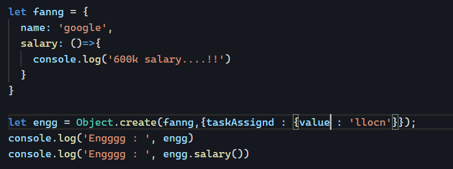
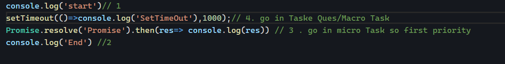
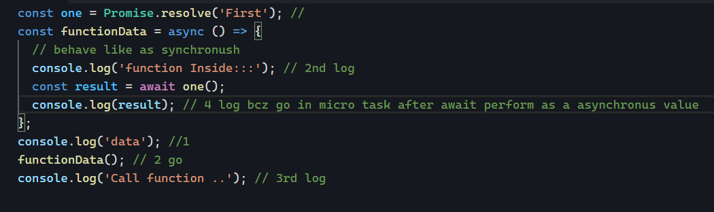
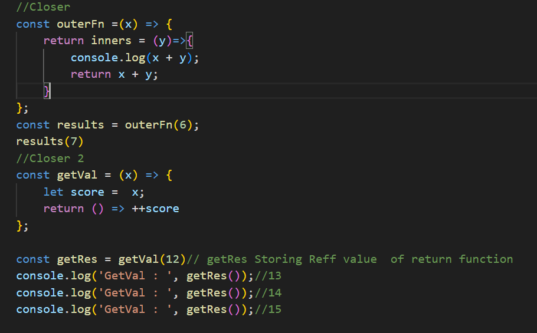
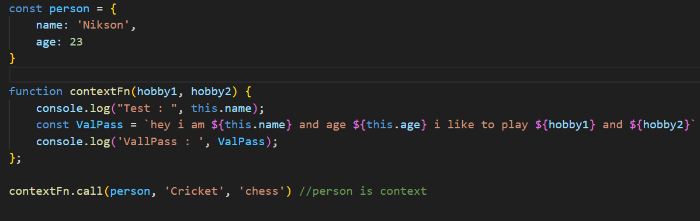

> # EVENT LOOP
- We know that JavaScript is a single-threaded language, but the UI does not get stuck because its behavior is asynchronous and non-blocking. The event loop monitors everything in the call stack and tasks. First, it checks the microtask queue and then the task queue. If anything is present, it will be executed in the call stack. This process is known as asynchronous behavior.
- Here we have container - 
01. call stack -  
02. web API/Browser API, 
03. macro Task Que/task Queue,
04. micro task  

> # Hoisting and Temporary Ded Zone
- We know that JavaScript prepares memory (this phase is called hoisting) first and then executes the code. During preparation, JavaScript will scan your code, and the references for your declarations (functions, let, const, and var) will be stored in memory.

Q// How to memory declration
Ans - 
01. function - A function only stores as a reference to its location in memory.
02. Let, const - Memory stores Uninitialized.
03. Var - undefined memory stores.
# Some cases of Declration
- case-1 : Access Function before decleration then no Issue
- case-2 : Access Var before decleration then undefine
- case-1 : Access Let/const before decleration then Error will be come Reffrance Error
# Temporary Ded Zone
- useing variable and function before actual decleration is called .

> # SCOPE AND SCOPE CHAIN
- It only defines the accessibility range, which may be at the function level, window level, or global level.
- Three type of Scope: 
01. Global Scope
- Window and Global
02. Local Scope
- 
03. Block Scope
- function scope it define inside of {}.

# Scope Chain
-  Chain of reffrances (Define -  js will search in local scope first and step by step go on global scope and find out variable this process is call reff Chain).
- scop will go inner -> outer -> outer but cant be come from outer to inner.

> # PROTOTYPE INHERITANCE AND CHAINING
-  that allows objects to inherit properties and methods from other objects.
- Linking a property from the parent object to the child object allows the child object to share and utilize the properties of the parent class.
- Single proto inheritent only one class
- multiple is possible by Chaing(proto + proto)

- object.getgetPrototypeOf(faang) it will inheritet all property
- Object.setPrototypeOf()

> # Promises and Quese
- Promises provide a powerful way to handle asynchronous operations in JavaScript, making code more readable and maintainable code.
- That is a placeholder that can resolve and reject in future.
- Promise having two major things state and value.
- state/Status is three type - Pending(default), rejected(error), fullfilled(sucess).
- task Que - setTimeout, I/o operation, Ui Rendring, HTTP request and Timer all operation.it will go through browser Api
- micro Task -  Promise Handler then(), catch(), finally(), 

> # ASYNC And Await
- it is kind of promises
- Promise.resolve('Chai) === async()=>{return 'Chai} same 
- await -  can suspended async function while we wait for awaited value return a resolved promise after await reset the async function get run in microtask.
- 

> # Closer and Lexical Scope.

- In JavaScript, a closure is a feature where an inner function has access to the outer (enclosing) function’s variables,but outer function can't be acess inner variable is called closer.
- Inner lexical enviroment reffer to outer lexical enviroment. when outer lexical enviroment not refrance.

- count++ is post increment where ++count is pre increment. suppose you write count++ means value increase after execute this statement. but in case ++count value will increase while executing this line.
- ++count increments count immediately and returns the new value.
- count++ returns the current value of count and then increments it.

> # This Method
- In JavaScript, the this keyword is a special identifier that refers to the context in which a function is executed. 
- context may be Global or window
- this behav will be change depend on function and arrow function.

> # Call Apply And Bind
# call
- An immediately invoked function expression (IIFE) with a specified this value.

# Apply
- Kind of same but argumet Pass as an Array
contextFn.call(person, ['footbal', 'less']) //person is context 
# Bind
- Return a new function with copy of privious function
const Assign = contextFn.bind(person, 'test') 
 Assign('jolly');

 